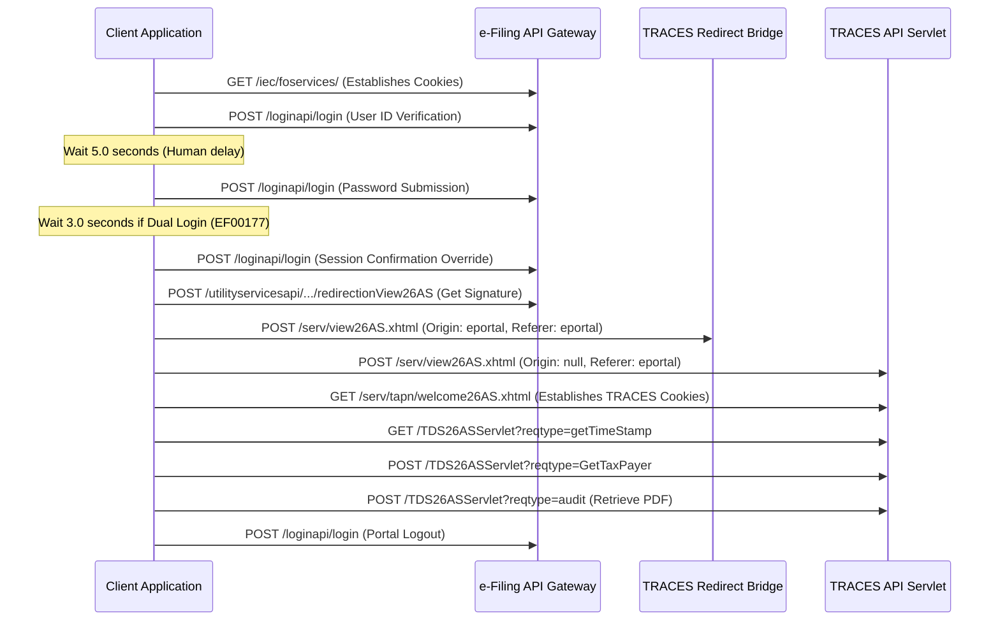

# Integration Guide: Form 26AS Pure API Retrieval

This document outlines the step-by-step backend API workflow to programmatically log in to the India Income Tax e-Filing portal, perform the cryptographic handshake, redirect to the TRACES portal, and fetch Form 26AS tax credit JSON data directly.

Refer to the verified script implementation in: [`download_26as_api.py`](file:///Users/dangodra/Downloads/Work/MASTER/Scrappung/26AS%20Tool/tools/download_26as_api.py)

---

## 1. Core Architecture Workflow



---

## 2. Detailed Step-by-Step API Specification

### Step 0: Establish Session Cookies
*   **Method**: `GET`
*   **URL**: `https://eportal.incometax.gov.in/iec/foservices/`
*   **Purpose**: Pull initial tracking and gateway cookies (like `693c4e2771754eedb1d75ba0debd40d8`).

### Step 1: User ID Verification
*   **Rules**: **MUST wait exactly 2.0 seconds** before making this call to simulate user typing and prevent bot rate-limits.
*   **Method**: `POST`
*   **URL**: `https://eportal.incometax.gov.in/iec/loginapi/login`
*   **Headers**:
    ```http
    Referer: https://eportal.incometax.gov.in/iec/foservices/
    Content-Type: application/json
    sn: wLoginService
    ```
*   **Payload**:
    ```json
    {"entity": "<PAN_NUMBER>", "serviceName": "wLoginService"}
    ```
*   **Expected Response**: JSON containing `"reqId"` and `"secAccssMsg"` (Secure Access Message).

### Step 2: Password Submission
*   **Rules**: **MUST wait exactly 5.0 seconds** before making this call to simulate user typing and prevent bot rate-limits.
*   **Method**: `POST`
*   **URL**: `https://eportal.incometax.gov.in/iec/loginapi/login`
*   **Headers**:
    ```http
    Referer: https://eportal.incometax.gov.in/iec/foservices/
    Content-Type: application/json
    sn: loginService
    ```
*   **Payload**:
    ```json
    {
      "aadhaarMobileValidated": "false",
      "dtoService": "LOGIN",
      "entity": "<PAN_NUMBER>",
      "entityType": "PAN",
      "errors": [],
      "exemptedPan": "false",
      "imagePath": null,
      "imgByte": null,
      "pass": "<BASE64_ENCODED_PASSWORD>",
      "passValdtnFlg": null,
      "reqId": "<REQ_ID_FROM_STEP_1>",
      "role": "IN",
      "secAccssMsg": "<MESSAGE_FROM_STEP_1>",
      "secLoginOptions": "",
      "serviceName": "loginService",
      "uidValdtnFlg": "true",
      "userConsent": ""
    }
    ```

#### Handling Dual Login Conflicts (Active Session)
If the response messages contain code `EF00177` (Session already active):
1.  **Wait exactly 3.0 seconds** (simulates reading modal and clicking continue).
2.  Clone the entire step 2 response dictionary (`response.json()`).
3.  Modify/overwrite these fields:
    ```json
    {
      "pass": null,
      "otpGenerationFlag": "true",
      "otpValdtnFlg": "true",
      "remark": "Continue",
      "serviceName": "loginService"
    }
    ```
4.  POST this payload to `https://eportal.incometax.gov.in/iec/loginapi/login` with `sn: loginService`.

### Step 3: Get Redirection Signature
*   **Method**: `POST`
*   **URL**: `https://eportal.incometax.gov.in/iec/utilityservicesapi/auth/v0.1/redirectionView26AS`
*   **Headers**:
    ```http
    Referer: https://eportal.incometax.gov.in/iec/foservices/
    Content-Type: application/json
    sn: NA
    ```
*   **Payload**:
    ```json
    {"pan": "<PAN_NUMBER>", "ay": "<ASSESSMENT_YEAR>", "actType": "O"}
    ```
*   **Expected Response**: JSON containing `"data"` and `"signature"`.

### Step 4: TRACES Handshake (Manual Redirection Follow)
Standard HTTP libraries fail here because they auto-follow redirects, updating the `Referer` to the intermediate domains. **You must step through these redirects manually with exact header profiles.**

#### Request 4.1: POST to TRACES Bridge Entry
*   **URL**: `https://services.tdscpc.gov.in/serv/view26AS.xhtml`
*   **Method**: `POST` (Follow redirects: `False`)
*   **Headers**:
    ```http
    Content-Type: application/x-www-form-urlencoded
    Origin: https://eportal.incometax.gov.in
    Referer: https://eportal.incometax.gov.in/
    ```
*   **Form Payload**: `data=<DATA_FROM_STEP_3>&signature=<SIGNATURE_FROM_STEP_3>`
*   **Expected Response**: `307 Temporary Redirect`

#### Request 4.2: POST to TRACES Dynamic Target
*   **URL**: `<LOCATION_HEADER_FROM_REQUEST_4.1>` (e.g. `https://traces61services.tdscpc.gov.in/serv/view26AS.xhtml`)
*   **Method**: `POST` (Follow redirects: `False`)
*   **Headers**:
    ```http
    Content-Type: application/x-www-form-urlencoded
    Origin: null
    Referer: https://eportal.incometax.gov.in/
    ```
*   **Form Payload**: `data=<DATA_FROM_STEP_3>&signature=<SIGNATURE_FROM_STEP_3>`
*   **Expected Response**: `302 Found`

#### Request 4.3: GET welcome landing
*   **URL**: `<LOCATION_HEADER_FROM_REQUEST_4.2>` (e.g. `http://traces61services.tdscpc.gov.in/serv/tapn/welcome26AS.xhtml`)
*   **Method**: `GET` (Follow redirects: `False`)
*   **Headers**:
    ```http
    Origin: https://eportal.incometax.gov.in
    Referer: https://eportal.incometax.gov.in/
    ```
*   **Expected Response**: `307 Temporary Redirect` (Upgrades to SSL)

#### Request 4.4: Final GET welcome landing
*   **URL**: `<LOCATION_HEADER_FROM_REQUEST_4.3>` (e.g. `https://traces61services.tdscpc.gov.in/serv/tapn/welcome26AS.xhtml`)
*   **Method**: `GET` (Follow redirects: `True`)
*   **Headers**:
    ```http
    Referer: https://eportal.incometax.gov.in/
    ```
*   **Expected Response**: `200 OK` (Establishes authenticated `JSESSIONID` and `gateway` cookies).

### Step 5: Initialize TRACES View
*   **Method**: `GET`
*   **URL**: `https://traces61services.tdscpc.gov.in/serv/tapn/view26AS.xhtml`
*   **Headers**:
    ```http
    Referer: https://traces61services.tdscpc.gov.in/serv/tapn/welcome26AS.xhtml
    ```

### Step 6: Fetch Time Stamp Token
*   **Method**: `GET`
*   **URL**: `https://traces61services.tdscpc.gov.in/serv/tapn/srv/TDS26ASServlet`
*   **Params**: `reqtype=getTimeStamp&_=<EPOCH_MILLISECONDS>`
*   **Headers**:
    ```http
    Referer: https://traces61services.tdscpc.gov.in/serv/tapn/view26AS.xhtml
    ```
*   **Expected Response**: `[{"enc1": "<TIMESTAMP_TOKEN>"}]`

### Step 7: Retrieve JSON Tax Credits Table
*   **Method**: `POST`
*   **URL**: `https://traces61services.tdscpc.gov.in/serv/tapn/srv/TDS26ASServlet`
*   **Headers**:
    ```http
    Referer: https://traces61services.tdscpc.gov.in/serv/tapn/view26AS.xhtml
    Content-Type: application/x-www-form-urlencoded; charset=UTF-8
    X-Requested-With: XMLHttpRequest
    ```
*   **Form Payload**:
    ```http
    reqtype=GetTaxPayer&assessYear=<ASSESSMENT_YEAR>&viewType=HTML
    ```
*   **Expected Response**: Structured JSON payload containing TDS, TCS, and tax payment grids.

### Step 8: Trigger Audit Log (Retrieve Government PDF Statement)
*   **Method**: `POST`
*   **URL**: `https://traces61services.tdscpc.gov.in/serv/tapn/srv/TDS26ASServlet`
*   **Headers**:
    ```http
    Referer: https://traces61services.tdscpc.gov.in/serv/tapn/view26AS.xhtml
    X-Requested-With: XMLHttpRequest
    Content-Type: application/x-www-form-urlencoded
    ```
*   **Form Payload**:
    ```http
    reqtype=audit&assessYear=<ASSESSMENT_YEAR>&viewType=CLPDF
    ```
*   **Expected Response**: Nothing.
*   **Notes**: It is just for audit loggin to income tax website as a proof that user downoloded pdf but actully this does not give any response actual website also genrate pdf from xhtml thing and return so we are doing after portal logout JSON is mainpriority.

### Step 9: Portal Logout
*   **Method**: `POST`
*   **URL**: `https://eportal.incometax.gov.in/iec/loginapi/login`
*   **Headers**:
    ```http
    Referer: https://eportal.incometax.gov.in/iec/foservices/
    Content-Type: application/json
    sn: logoutService
    ```
*   **Payload**:
    ```json
    {"serviceName": "logoutService", "entity": "<PAN_NUMBER>", "userType": "IND"}
    ```
*   **Expected Response**: JSON indicating logout status. Clearing cookies is recommended to finalize the session cleanup.

---

## 3. Important Implementation Notes

1.  **User-Agent Profile Integrity**: Use a modern, consistent browser User-Agent across all steps (e.g. Chrome 126+). Avoid older versions which trigger automatic F5 blocks.
2.  **Redirect Referer Policy**: Ensure the intermediate redirect requests do NOT drop the `Referer: https://eportal.incometax.gov.in/`. If it is lost or updated to `tdscpc.gov.in`, the firewall redirects to `autherror.xhtml`.
3.  **Cookie Management**: A single cookie jar must persist cookies from Step 0 through Step 7.
